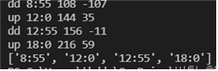

# [한이음2021_Hanium_21_HI023] AI와 친환경 소재 IoT를 활용한 사용자 활동기반 댁내 살균 서비스 구축

Role: Android, Back-end Dev, Flask, MySQL

공모전: 2021 한이음 제출

소요시간: 2021.03 ~ 2021.12

팀원 수: 3

# 주제

AI와 친환경 소재 IoT를 활용한 사용자 활동기반 댁내 살균 서비스 구축

# 기능

- **사람객체 인식**

라즈베리파이에 연결된 pi camera를 통해 yolo v4 tiny를 이용해 사람 객체를 인식했다.

- **데이터 전송 및 저장**

카메라용 라즈베리파이에서 Python Library인 apscheduler를 이용해 1초마다 소켓통신을 통해 flask 웹서버에 사람 객체 인식 수를 전송한다. 웹서버에서는 다중 스레드를 이용해 복수의 라즈베리파이로부터 데이터를 받아와 mysql에 저장한다.

- **살균 알고리즘 및 군집화 알고리즘**

일 단위로 쌓이는 데이터를 기반으로 다음 날 살균 시간을 예측하여 알려준다. 일 주 단위의 데이터가 쌓이면 주중 /주말로 데이터를 분류하여 군집화 알고리즘을 시행 데이터를 3가지 특징을 가진 형태로 분류하여 살균의 상중하를 이루도록 한다.

- **앱을 통한 제어**

사용자가 앱을 통해 즉각 살균을 할 수 있다. 사용자가 앱의 “즉각 살균” 버튼을 누르면 http통신을 통해 현재 서버에 연결된 살균기 목록과 고유 ID를 JSON형태로 받아오고, 안드로이드 앱에서는 각 살균기 버튼에 http통신 이벤트를 설정한다.
만약 사용자가 특정 장소의 “즉각 살균”버튼을 누르면 http통신을 통해 웹 서버에 살균 요청이 전달되고, 웹 서버에서는 살균기용 라즈베리파이로 소켓통신을 통해 살균 명령을 내린다.

- **살균 기능**

AI기반 자동살균 혹은 앱을 통한 즉각 살균을 서버에서 살균기용 라즈베리파이로 명령을 전송하면 정해진 살균강도로 수소수를 가습기 모듈을 이용해 살균을 한다.

# 적용기술

- yolov4-tiny
- clustering
- muti thread
- mysql
- socket 통신

# 역할

- Flask 프레임워크를 이용한 웹서버 개발
- 라즈베리파이와 웹서버간 소켓통신 구현
- YOLO를 이용한 사람객체 인식
